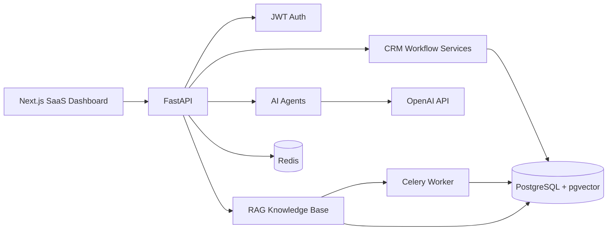

# LeadPilot AI

[](https://github.com/lukemadeit09/leadpilot-ai/actions/workflows/ci.yml)

LeadPilot AI is an AI-powered CRM automation platform that reads customer messages, analyzes leads, generates replies, saves data to a CRM, creates follow-up tasks, and helps sales teams work faster.

## Product Summary

LeadPilot AI demonstrates a production-style B2B SaaS workflow: a sales rep submits an inbound email, the backend runs an agentic AI workflow, the CRM pipeline is updated, a follow-up task is created, and the dashboard reflects the operational state.

## Features

- JWT authentication with register, login, and current-user endpoints
- Organization-scoped multi-tenancy with owner, admin, and member roles
- CRM lead management with status tracking, search, filtering, scoring, and lead detail views
- AI email analyzer with structured output for summary, sentiment, urgency, category, score, buying intent, reply, and follow-up task
- AI usage tracking with Starter, Pro, and Agency monthly limits plus simple/complex model routing
- Billing foundation with plan catalog, owner/admin plan updates, and dashboard credit visibility
- Async AI lead analysis jobs with Celery, Redis, durable status tracking, retries, and frontend polling
- Multi-agent backend design: analyzer, scoring, reply, CRM, and task agents
- Agentic workflow that persists lead, analysis, task, and activity log in one transaction
- RAG knowledge base with PDF/text uploads, background chunking, embeddings, semantic search, pgvector-ready storage, and citations
- Security hardening with rate limits, security headers, upload validation, failed-login tracking, audit logs, and hashed organization API keys
- Dashboard metrics, pipeline chart, activity timeline, task queue, and modern dark SaaS UI
- Dockerized frontend, backend, PostgreSQL, and Redis
- Environment-variable based configuration with no committed secrets

## Tech Stack

- Frontend: Next.js, TypeScript, Tailwind CSS, Recharts, Lucide icons
- Backend: FastAPI, SQLAlchemy, Pydantic, PostgreSQL, JWT auth
- AI: OpenAI API, structured JSON outputs, embeddings for document search
- Infrastructure: Docker, Docker Compose, Redis-ready service configuration

## Architecture



More detail is available in [docs/ARCHITECTURE.md](docs/ARCHITECTURE.md).

Architecture and runtime sequence diagrams are available in [docs/DIAGRAMS.md](docs/DIAGRAMS.md).

Billing and usage quota details are available in [docs/BILLING.md](docs/BILLING.md).

Async worker details are available in [docs/ASYNC_WORKERS.md](docs/ASYNC_WORKERS.md).

RAG knowledge base details are available in [docs/RAG.md](docs/RAG.md).

Security hardening details are available in [docs/SECURITY.md](docs/SECURITY.md).

Observability and monitoring details are available in [docs/OBSERVABILITY.md](docs/OBSERVABILITY.md).

## Folder Structure

```text
leadpilot-ai/
  backend/
    app/
      agents/
      auth/
      models/
      routes/
      schemas/
      services/
  frontend/
    app/
    components/
    hooks/
    lib/
    types/
  docs/
  docker-compose.yml
  .env.example
```

## Local Setup

1. Create a local env file:

```bash
cp .env.example .env
```

2. Set `JWT_SECRET_KEY` to a long random value.

3. Optional: set `OPENAI_API_KEY` to enable live model calls. Without it, the backend uses deterministic demo fallbacks so the app still runs locally.

4. Start the full stack:

```bash
docker compose up --build
```

5. Open the app:

```text
Frontend: http://localhost:3000
Backend API: http://localhost:8000
API docs: http://localhost:8000/docs
```

## Manual Development

Backend:

```bash
cd backend
python -m venv .venv
.venv\Scripts\activate
pip install -r requirements.txt
alembic upgrade head
uvicorn app.main:app --reload
```

Database schema changes are managed with Alembic. The API no longer creates tables during FastAPI startup; run migrations before starting the backend in every environment.

Backend tests:

```bash
cd backend
.venv\Scripts\activate
pip install -r requirements-dev.txt
cd ..
pytest
```

Frontend:

```bash
cd frontend
npm install
npm run dev
```

## CI

GitHub Actions runs on every pull request and every push to `main`.

The CI workflow checks:

- backend dependency install
- backend compile check
- backend pytest suite
- Python security scan with Bandit
- frontend dependency install with `npm ci`
- frontend typecheck
- frontend production build
- production dependency audit with `npm audit --omit=dev`

CI uses mock/test environment variables and does not require real OpenAI, Stripe, or other secret keys.

## Environment Variables

- `DATABASE_URL`: PostgreSQL connection string
- `REDIS_URL`: Redis connection string
- `JWT_SECRET_KEY`: signing secret for access tokens
- `JWT_ISSUER`: issuer claim expected in JWT access tokens
- `ACCESS_TOKEN_EXPIRE_MINUTES`: access token lifetime
- `OPENAI_API_KEY`: optional OpenAI API key
- `OPENAI_MODEL`: chat model for AI agents
- `OPENAI_SIMPLE_MODEL`: lower-cost model for lightweight AI tasks such as reply generation
- `OPENAI_COMPLEX_MODEL`: stronger model for multi-step lead analysis workflows
- `OPENAI_EMBEDDING_MODEL`: embedding model for document chunks
- `CORS_ORIGINS`: comma-separated frontend origins
- `MAX_UPLOAD_BYTES`: maximum knowledge base upload size
- `RATE_LIMIT_AUTH_PER_MINUTE`: auth endpoint rate limit
- `RATE_LIMIT_AI_PER_MINUTE`: AI endpoint rate limit
- `RATE_LIMIT_BILLING_PER_MINUTE`: billing endpoint rate limit
- `RATE_LIMIT_PUBLIC_PER_MINUTE`: public integration endpoint rate limit
- `FAILED_LOGIN_LOCK_THRESHOLD`: failed login attempts before temporary lockout
- `FAILED_LOGIN_LOCK_MINUTES`: temporary lockout duration
- `LOG_LEVEL`: backend structured logging level
- `SENTRY_DSN`: optional backend Sentry DSN
- `SENTRY_TRACES_SAMPLE_RATE`: optional backend Sentry tracing sample rate
- `NEXT_PUBLIC_API_URL`: browser-facing backend URL
- `NEXT_PUBLIC_APP_ENV`: browser-safe frontend environment name
- `NEXT_PUBLIC_SENTRY_DSN`: optional browser-safe frontend Sentry DSN
- `NEXT_PUBLIC_SENTRY_TRACES_SAMPLE_RATE`: optional frontend Sentry tracing sample rate
- `SENTRY_ORG`, `SENTRY_PROJECT`, `SENTRY_AUTH_TOKEN`: optional source map upload configuration for Sentry builds

## API Overview

- `POST /auth/register`
- `POST /auth/login`
- `GET /auth/me`
- `GET /health`
- `GET /live`
- `GET /ready`
- `GET /dashboard/metrics`
- `GET /leads`
- `POST /leads`
- `GET /leads/{id}`
- `PATCH /leads/{id}`
- `DELETE /leads/{id}`
- `POST /ai/analyze-lead`
- `POST /ai/analyze-lead/jobs`
- `GET /ai/jobs/{id}`
- `POST /ai/generate-reply`
- `GET /billing/plans`
- `GET /billing/usage`
- `PATCH /billing/plan`
- `POST /integrations/api-keys`
- `GET /integrations/api-keys`
- `DELETE /integrations/api-keys/{id}`
- `POST /integrations/public/leads`
- `GET /tasks`
- `POST /tasks`
- `PATCH /tasks/{id}`
- `DELETE /tasks/{id}`
- `POST /knowledge/upload`
- `GET /knowledge/documents`
- `POST /knowledge/search`
- `POST /knowledge/ask`
- `GET /activity`

## Screenshots

Add screenshots here after running the app locally:

- Landing page
- Dashboard
- AI analyzer workflow
- Leads table
- Knowledge base

## Portfolio Notes

This project is structured to demonstrate practical AI automation engineering: multi-step business workflows, backend orchestration, database persistence, secure auth, AI agent boundaries, RAG ingestion, and a recruiter-friendly SaaS interface.

## Future Improvements

- Add Alembic migrations for production schema evolution
- Add WebSocket activity streaming to the dashboard
- Add role-based admin controls and organization workspaces
- Add email sending provider integration for approved AI replies
