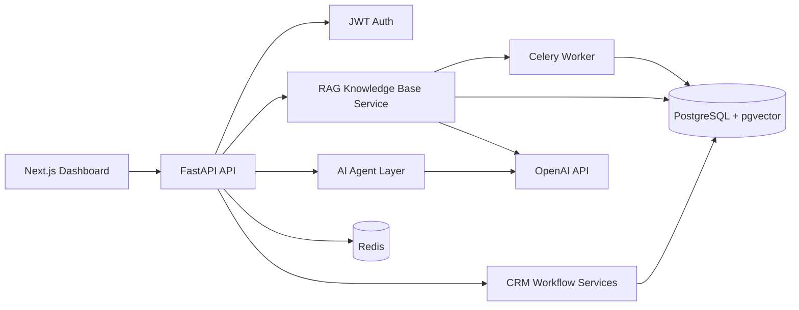

# LeadPilot AI Architecture

LeadPilot AI is a production-style B2B SaaS application for AI-assisted lead operations. The system turns customer messages into structured CRM records, scored opportunities, generated replies, follow-up tasks, and searchable activity.

## System Shape



Additional architecture and sequence diagrams are available in [DIAGRAMS.md](DIAGRAMS.md).

## Monorepo Layout

```text
leadpilot-ai/
  frontend/      Next.js, TypeScript, Tailwind dashboard
  backend/       FastAPI, SQLAlchemy, Pydantic, JWT, AI agents
  docs/          Architecture notes and diagrams
  docker-compose.yml
  .env.example
  .gitignore
```

## Backend Boundaries

- `routes`: HTTP API surface grouped by product domain.
- `models`: SQLAlchemy persistence models.
- `schemas`: Pydantic request and response contracts.
- `services`: Business workflows that coordinate database writes.
- `agents`: AI roles with a clean interface around OpenAI.
- `auth`: Password hashing, JWT creation, and current-user dependencies.

## Data Model

Core tables:

- `users`: authenticated SaaS users.
- `leads`: CRM records with status, score, sentiment, and urgency.
- `lead_analyses`: structured AI output for submitted messages.
- `tasks`: follow-up work, manually or AI-created.
- `activity_logs`: audit trail for CRM actions.
- `uploaded_documents`: organization-scoped knowledge base files with processing status.
- `knowledge_chunks`: searchable document chunks with source metadata, embeddings, and pgvector-ready vector storage.

## Agentic Workflow

When a sales rep submits a message:

1. `AnalyzerAgent` extracts summary, sentiment, urgency, category, pain points, and buying intent.
2. `ScoringAgent` computes a lead score from the analysis.
3. `ReplyAgent` drafts a professional response.
4. `CRMAgent` recommends pipeline status and next action.
5. `TaskAgent` creates a follow-up task.
6. The workflow service persists the lead, analysis, task, and activity log in one transaction.

## API Plan

- `POST /auth/register`, `POST /auth/login`, `GET /auth/me`
- `GET /leads`, `POST /leads`, `GET /leads/{id}`, `PATCH /leads/{id}`, `DELETE /leads/{id}`
- `POST /ai/analyze-lead`, `POST /ai/generate-reply`
- `GET /tasks`, `POST /tasks`, `PATCH /tasks/{id}`, `DELETE /tasks/{id}`
- `POST /knowledge/upload`, `GET /knowledge/documents`, `POST /knowledge/search`, `POST /knowledge/ask`
- `GET /activity`

## Implementation Roadmap

1. Bootstrap repo, Git, env examples, Docker, and architecture docs.
2. Implement FastAPI foundation with database session handling, auth, and models.
3. Build lead, task, activity, AI workflow, and knowledge base routes.
4. Build Next.js dashboard shell with protected pages and API client.
5. Add CRM tables, analyzer form, task management, charts, and responsive SaaS UI.
6. Verify local run path, document setup, and keep commits clean.
