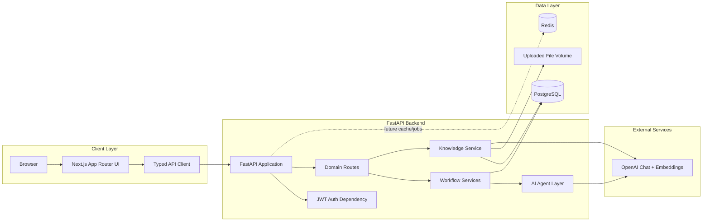
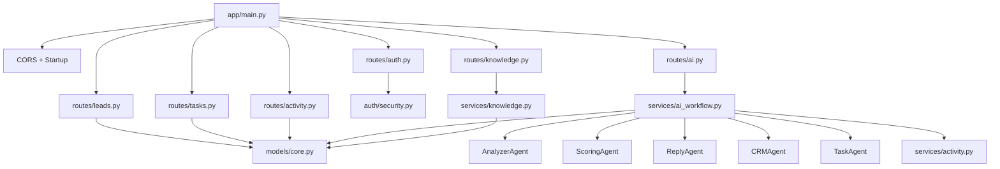
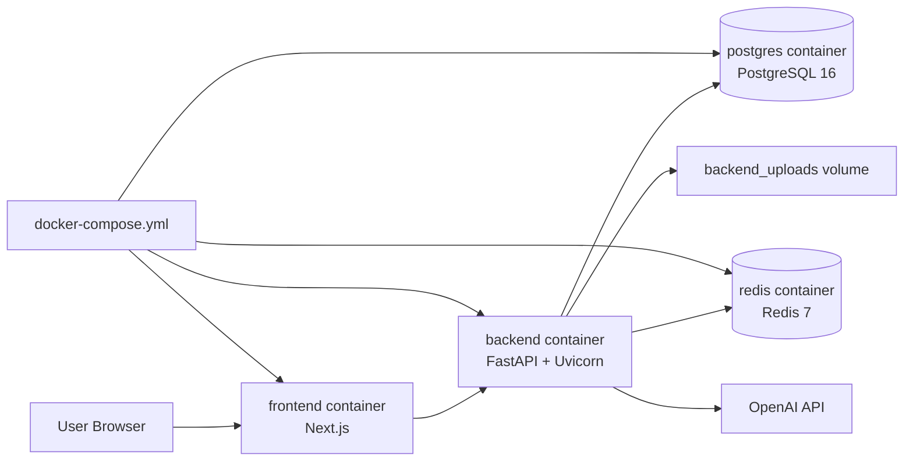
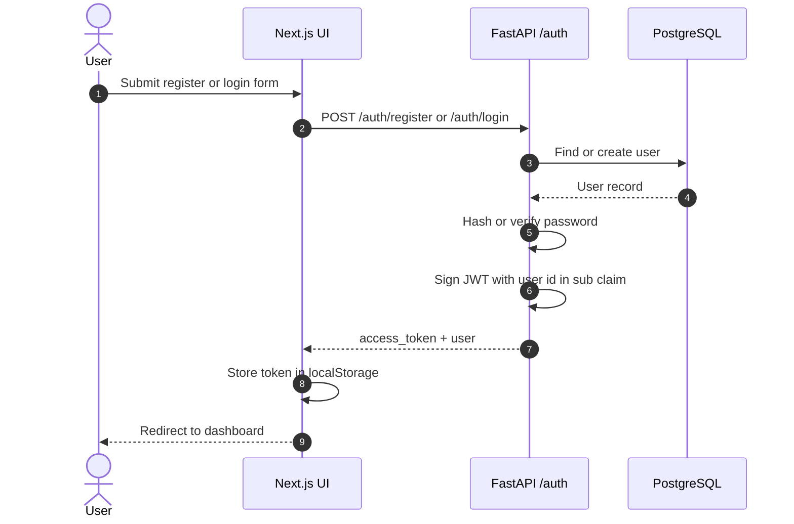
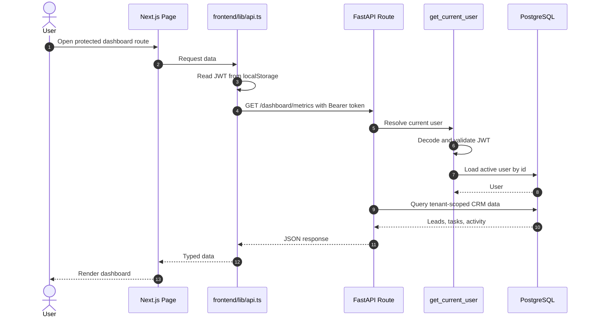
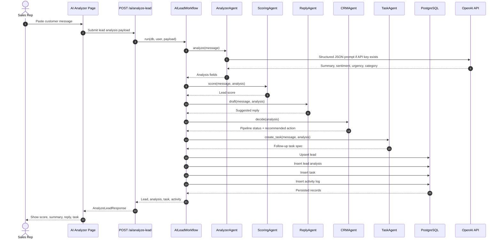
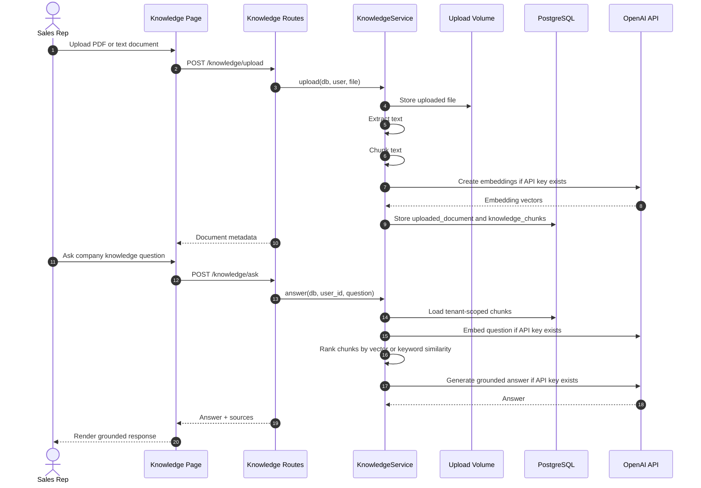
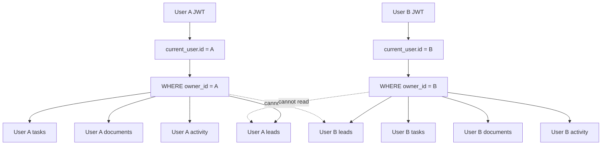
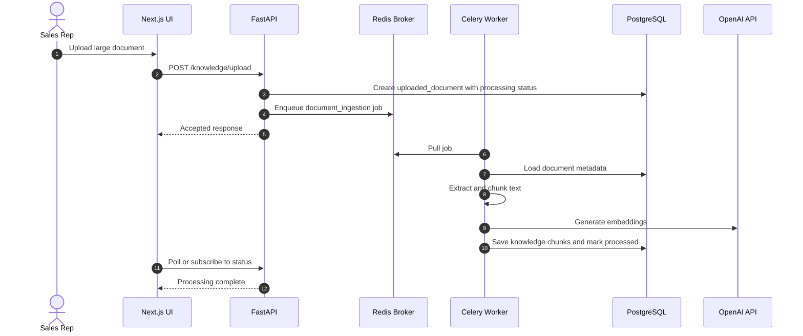

# LeadPilot AI Diagrams

This document captures the system architecture and main runtime flows for LeadPilot AI using Mermaid diagrams that render in GitHub.

## System Architecture

## Backend Module Architecture

## Deployment Architecture

## Authentication Sequence

## Protected Request Sequence

## AI Lead Analysis Lifecycle

## Knowledge Base RAG Sequence

## Multi-Tenant Data Isolation

## Future Celery and Redis Workflow

Redis exists in the Docker stack today as infrastructure for caching and future background processing. Celery is not implemented yet, but this is the intended production evolution:

